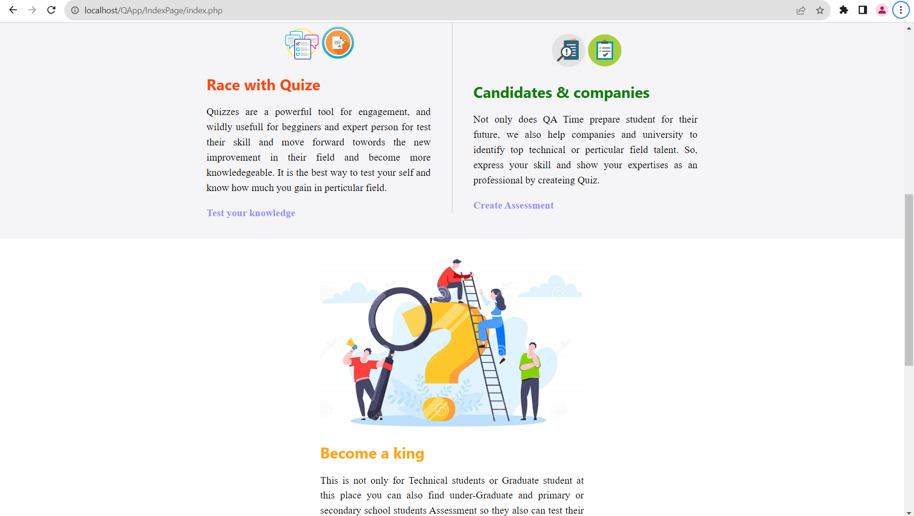
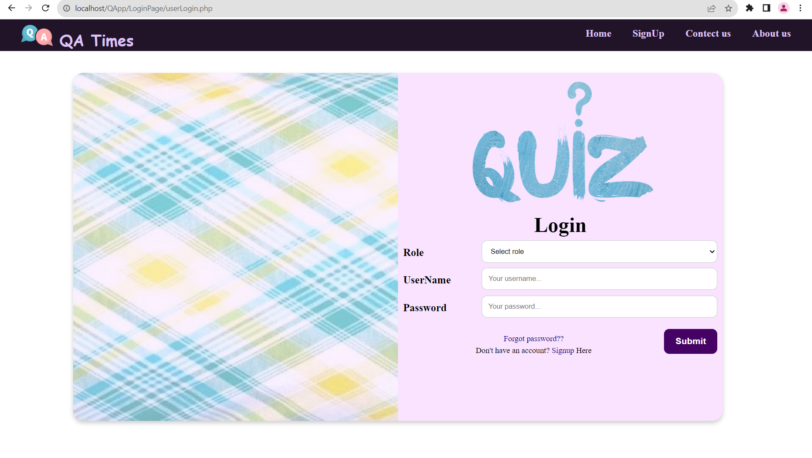
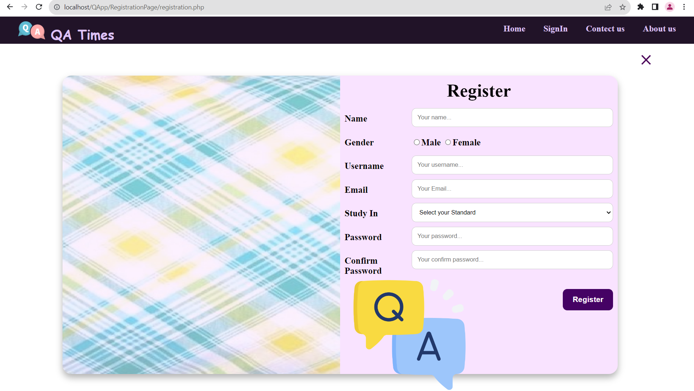
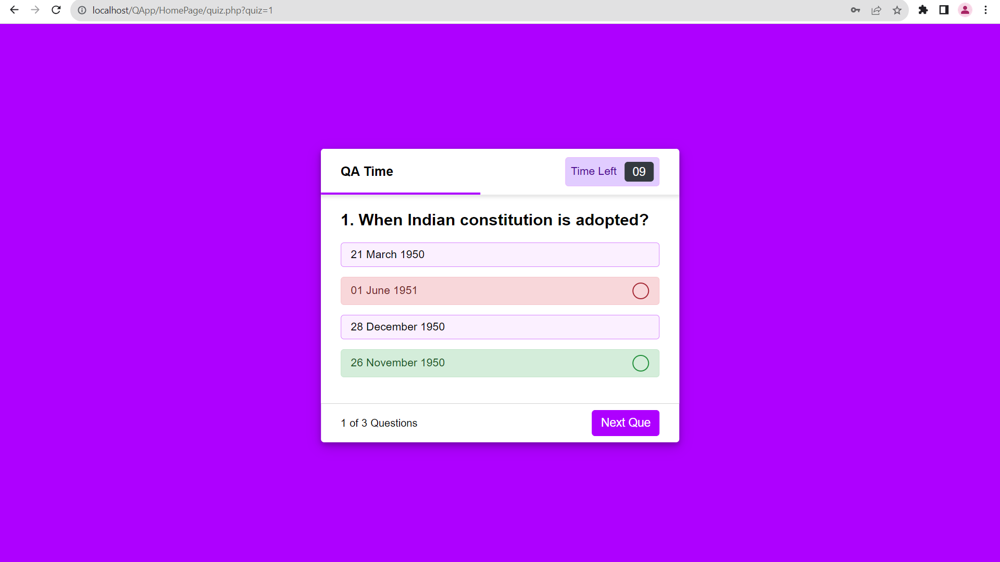
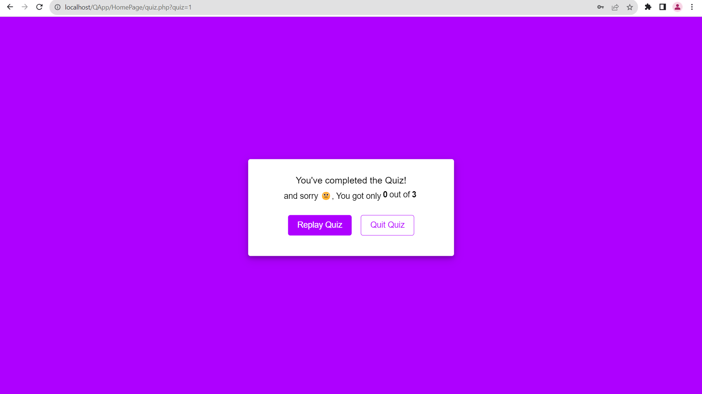
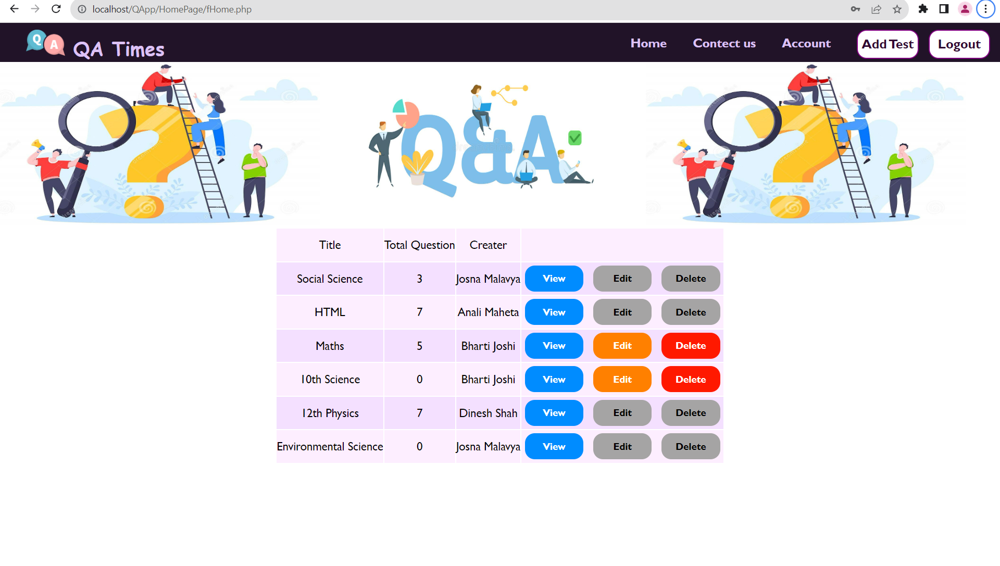
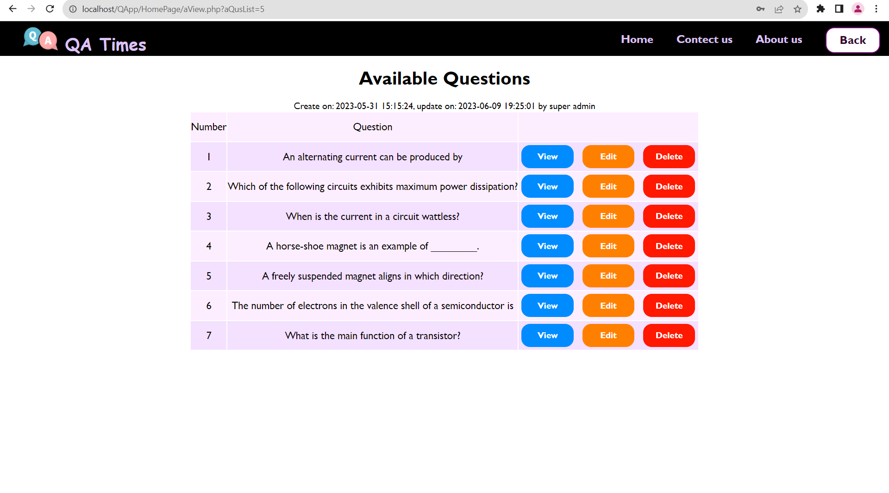
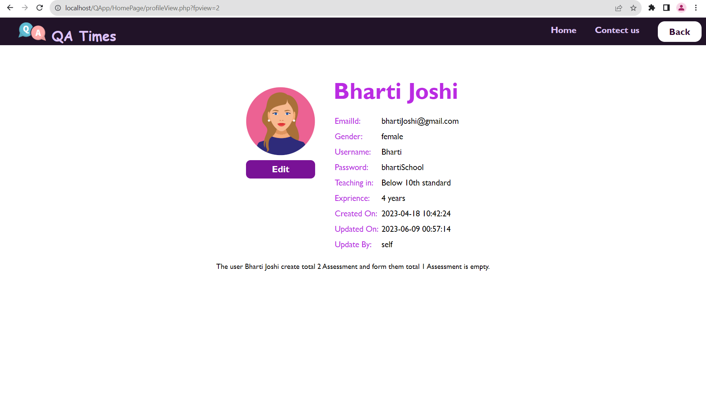
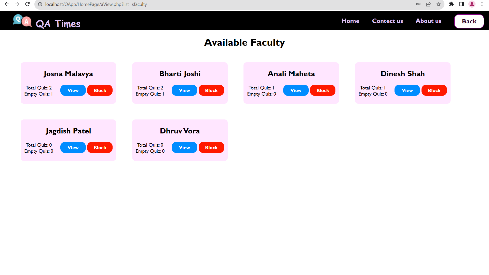

# 📚 QuizMaster – Online Quiz & Assessment Platform

**QuizMaster** is a powerful web-based assessment platform designed to help students practice daily quizzes, improve learning outcomes, and support educational management for faculty and admins.

---

## 🚀 Features





### 👤 **User Roles**
- **Student**
- **Faculty**
- **Admin**
- **Super Admin**

### 🔐 **Authentication**
- Login, Registration, Forgot Password
- Secure role-based access system




### 🎓 **Student Dashboard**
- Take quizzes created by different faculty
- Timed assessments (per question)
- View quiz scores and performance history
- Update personal profile
- Contact Admin/Super Admin via internal messaging





### 👩‍🏫 **Faculty Dashboard**
- Create, edit, and delete their own assessments
- View other assessments (read-only)
- Track their own assessment stats (created/empty)
- View creation/update logs with user details
- Contact Admin/Super Admin for queries or issues





### 🛡️ **Admin Panel**
- Manage faculty, students, and assessments
- Review and approve Admin registration requests
- Monitor faculty activity (e.g., empty or copied assessments)
- Respond to queries from students and faculty


### 🦸 **Super Admin Panel**
- Full website access and control
- Approve/reject Admin registration requests
- Add, edit, delete any user (student/faculty/admin)
- Manage all assessments and messages
- Oversee the entire platform operation





---

## 🧰 Tech Stack

| Technology | Description                     |
|------------|---------------------------------|
| PHP        | Backend scripting language      |
| MySQL      | Relational database management  |
| HTML/CSS   | Structure and styling           |
| JavaScript | Frontend interactivity          |

---

## 🛠️ Installation Guide (Using XAMPP)

Follow these steps to set up and run the Quiz Platform on your local machine using XAMPP.

---

### 1. Start XAMPP and Services

- Open the **XAMPP Control Panel**.
- Start the following services:
  - **Apache**
  - **MySQL**

---

### 2. Open phpMyAdmin

Open your browser and go to:
http://localhost/phpmyadmin/

---

### 3. Create the Database

1. In phpMyAdmin, click **New** to create a new database.
2. Name the database (example: `quiz_platform`).
3. Import the database schema:

   - Click on the database you just created.
   - Go to the **Import** tab.
   - Choose the SQL file from your project:

     ```
     /Database/database.sql
     ```

---

### 4. Update Database Configuration

Edit the database configuration file, set your local database configuration as follows:

```
<?php
$host = "localhost";
$user = "root";
$pass = "";
$dbname = "quiz_platform";
?>
```

---

### 5. Move Project to XAMPP's Web Root
Copy the entire project folder to XAMPP's htdocs directory:

```
C:/xampp/htdocs/
```
Example project path:
```
C:/xampp/htdocs/QApp/
```

---

### 6. Run the Application
Open your browser and navigate to:

```
http://localhost/QApp/IndexPage/index.php
```
Your application should now be running locally.